# 🚀 ITI Capstone Project : Full GitOps Pipeline on AWS with Terraform, and Secrets Management


## 📌 Project Overview

This project showcases a complete GitOps-based CI/CD pipeline using Terraform, Amazon EKS, and modern DevOps tooling ( Jenkins , ArgoCD ). It demonstrates how to provision infrastructure as code, deploy a Node.js web application backed by MySQL and Redis, manage secrets securely, and enable fully automated deployments using GitOps principles.

---

## 🧰 Tech Stack

☁️  **Terraform** for provisioning infrastructure (VPC, subnets, NAT, IGW, EKS , ECR , EBS , IAM Roles & Policies , IRSA , RBAC)  
☸️ **Amazon EKS** for running Kubernetes workloads ( coupled with EBS CSI Driver )  
📦 **Helm** for CI/CD tools installation package management of Kubernetes applications  
⚙️ **Jenkins** for automated Docker build & Terraform deployment , triggered using **Github Webhook**
🚀 **ArgoCD** for GitOps-based CD  
🔁 **Argo Image Updater** for auto-updating images  
🔐 **External Secrets Operator** for syncing secrets from AWS Secrets Manager   
🐳 **Dockerized Application** Build using **Kubernetes Agent for Kaniko Pods** & Deployment using **ECR**  
📦 Stateful Services ( **MySQL** & **Redis** ) managed inside Kubernetes  
📈 **Auto Sync & Deployments** based on Git updates and image changes  

---

## 🏗️ Architecture Diagrams

### Terraform Infrastructure

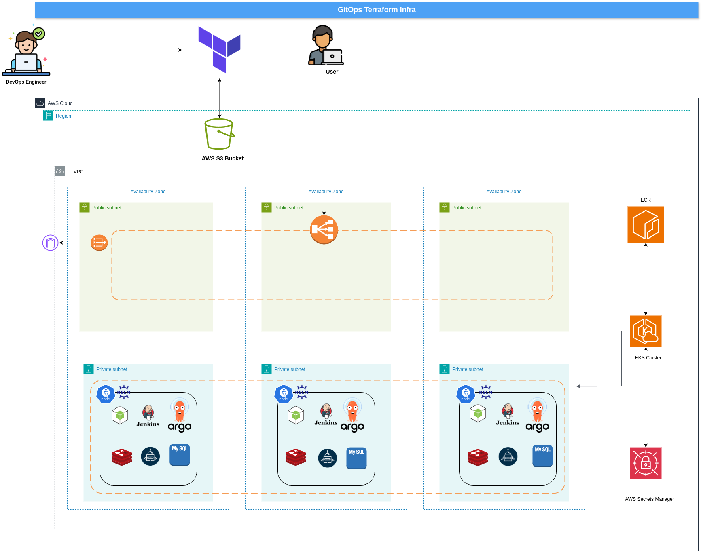

### CI/CD Workflow

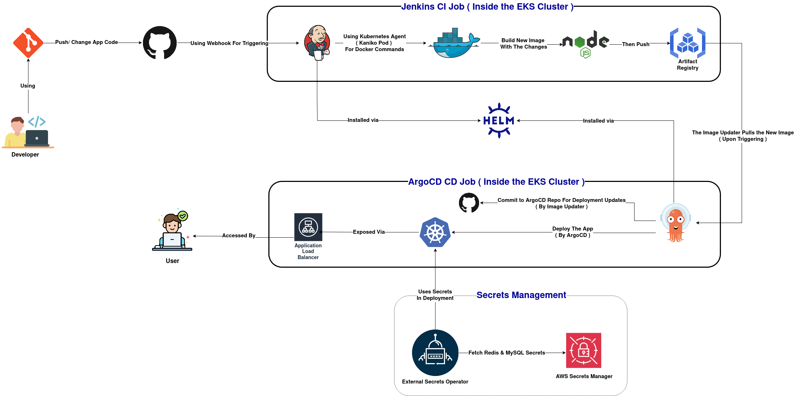


---

## 📂 Project Structure

#### The project consiste of 2 repos : 
- [Main Repo ( The current one ) ](https://github.com/NaghamMohamedMohamed/GitOps-Pipeline-On-AWS-Terraform.git) ➔ Hosts the core infrastructure and application components :

    - Terraform code for AWS infrastructure setup.
    - Node.js application source code.
    - Jenkins CI pipeline and related Kubernetes manifests.
    - Secrets configuration and manifests.

- [ArgoCD Repo](https://github.com/tokaashawky/GP_ArgoCD.git) ➔ Dedicated to GitOps delivery using ArgoCD :

    - ArgoCD & Imgae Updater application configurations.
    - Test application manifests.
    - Resources for troubleshooting ArgoCD sync and deployment flows.

---


## 🛠️ Key Features

### A. Infrastructure Provisioning – Terraform

- VPC with 3 public 3 private subnets across 3 AZs
- Internet & NAT Gateways, route tables

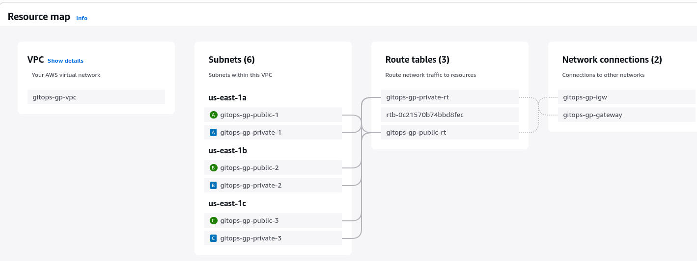

- Amazon EKS with 3 private worker nodes and EBS CSI driver

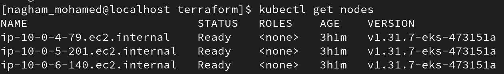

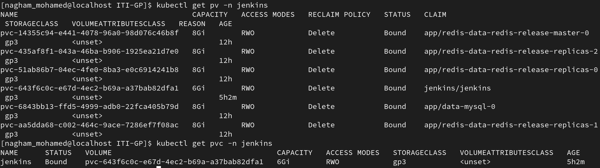

- TLS Certificate for OIDC Thumbprint :  

    a- **Description** :  This is a data block that retrieves the TLS certificate from the OIDC issuer URL (associated with the EKS cluster).  
    b- **Usage** : Extracts the certificate’s SHA1 thumbprint, which is required by AWS when creating an OIDC provider.  
    c- **Benefit** : Ensures secure integration with EKS's identity system (OIDC).  
    d- **Integration Role** : Uses the issuer URL exposed by the EKS cluster to retrieve TLS data, which is later used to configure IAM roles for service accounts.  

- OIDC Provider Setup : Enables IAM with OIDC federation ( Secure pod-based IAM )  

    a- **Description** : Creates an OIDC identity provider in IAM for the EKS cluster.  
    b- **Usage** : Allows Kubernetes service accounts to assume IAM roles via web identity federation.  
    c- **Benefit** : Enables fine-grained IAM permissions for Kubernetes workloads & Avoids long-lived credentials or mounting secrets.  
    d- **Integration Role** : Uses the TLS thumbprint from the previous block & References the same issuer URL from the EKS cluster.

- AssumeRoles :  
    a- **Description** : An AWS Security Token Service (STS) operation that enables :  

        - Temporary security credentials delegation  
        - Cross-account access  
        - Role switching within the same account  
        - Federated access for external users    

    b- **How It Works** :  
        - **Initiation**: An entity (user, application, or service) requests to assume a role  

        - **Validation**: AWS checks the role's trust policy and the requester's permissions
        - **Credentials Issuance**: If approved, AWS provides temporary credentials (access key, secret key, session token)  
        - **Access**: The requester uses these temporary credentials to make AWS API calls

    c- In EKS Context **two types of AssumeRole are used** :

        1. EKS Service Assuming Cluster Role :

        ```terraform
        Principal = {
        Service = "eks.amazonaws.com"
        }
        Action = "sts:AssumeRole"
        ```
        Allows EKS service to manage cluster resources

        ------------------------------------------------

        2. Web Identity Federation (IRSA) : 

        ```terraform
        Principal = {
        Federated = aws_iam_openid_connect_provider.eks.arn
        }
        Action = "sts:AssumeRoleWithWebIdentity"
        ```

        - **Allows Kubernetes pods to assume IAM roles using service accounts**
        - **Uses OIDC tokens instead of AWS credentials**

> [!Note]  
> AssumeRoleWithWebIdentity ➔ This is a specialized version of AssumeRole that :  
    - Uses OpenID Connect (OIDC) tokens instead of AWS credentials  
    - Requires an OIDC identity provider configured in IAM  
    - Is used for IAM Roles for Service Accounts (IRSA) in EKS  

### B. Continuous Integration – Jenkins via Helm

- Clones Node.js repo, builds Docker image
- Pushes to ECR and triggers app dir using webhook

### C. Continuous Deployment – ArgoCD via Helm

- Syncs Kubernetes manifests from Git
- Auto-updates with **Argo Image Updater** on new ECR images

### D. Secrets Management

- External Secrets Operator pulls from AWS Secrets Manager
- Injects MySQL and Redis credentials as K8s secrets

### E. Application Deployment

- Deploys app to EKS using Helm or Kustomize
- MySQL and Redis run in-cluster with secrets injection
    

---

## 🔧 Infrastructure Deployment

### 🔁 1. Clone Repository

```sh
# Step 1: Clone the main repository
git clone https://github.com/NaghamMohamedMohamed/GitOps-Pipeline-On-AWS-Terraform.git

# Step 2: Navigate into the main repo
cd GitOps-Pipeline-On-AWS-Terraform

# Step 3: Clone the ArgoCD repo into a temporary folder
git clone https://github.com/tokaashawky/GP_ArgoCD.git temp-argocd

# Step 4: Move contents of temp-argocd into current directory
mv temp-argocd/* temp-argocd/.* . 2>/dev/null || true

# Step 5: Remove the now-empty temporary folder
rm -rf temp-argocd
```

> [!Note]  
> 🔄 Alternative Approach :  
> You can also clone the two repositories into separate directories (by skipping steps 2, 4, and 5).  
> But, when working with Terraform, Jenkins, Secrets , and App files, navigate into the first repository directory.  
> Also, When applying or running the ArgoCD and Iamge Updater setup, switch to the second repository directory

> [!NOTE]  
> This repository already includes the full source code for the Node.js application—no need to clone a separate app repo.  
> You must replace the hardcoded AWS Account ID **576607007321** with **your own account ID** in the following files :   
    - **Main Repo ( Current One )** : jenkins-values.yaml , Jenkinsfile , All 4 service account YAML files in Manifests Dir  
    - **ArgoCD Repo** : image-updater-values.yml , .argocd-source-nodejs.yaml , deployment.yml , kustomization.yml
---

### 🌐 2. AWS Infrastructure Provisioning – With Terraform

```sh 
cd terraform

terraform init
terraform plan -auto-approve
terraform apply -var-file="terraform.tfvars" -auto-approve
```

---

### ⚙️ 3. CI Tool – Jenkins

#### 🧠 Concept :
Jenkins is used as the Continuous Integration (CI) engine. Instead of running jobs on static agents, it dynamically provisions Kubernetes pods (via the Kubernetes Cloud configuration in Jenkins). One of these pods runs Kaniko, a secure, Dockerless image builder, to build and push container images from source code changes — all inside Kubernetes.

This cloud-native approach ensures each build is :  
    - Isolated ✅  
    - Ephemeral 🔁  
    - Scalable 🚀  
    - Secure 🔒

#### 📋 Setup Steps ( Executed by Jenkins CI pipeline ) :

    🛠️ 1. Spin up a Kaniko Pod : Jenkins dynamically launches a Kubernetes pod based on a pre-defined kaniko-pod.yaml.

    📥 2. Checkout Source Code :
    The pipeline checks out your Node.js application's code from GitHub.

    🐳 3. Build Docker Image : Kaniko reads the Dockerfile and builds a container image securely — without requiring Docker.

    📤 4. Push to Amazon ECR :  The Kaniko executor pushes the built image to your AWS ECR registry using credentials provided via Kubernetes secret.


#### A. Connect to the EKS Cluster :

```sh
aws eks update-kubeconfig --region us-east-1 --name gitops-gp-eks-cluster
```

#### B. Verify Cluster Connection :

```sh
kubectl get nodes
```

#### C. Install Helm on the EKS Cluster :

```sh
curl https://raw.githubusercontent.com/helm/helm/main/scripts/get-helm-3 | bash

# Verify the Installation
helm version
```

#### D. Install Jenkins Repo via Helm :

```sh
# Add jenkinsci repo ( official repo )
helm repo add jenkinsci https://charts.jenkins.io/

# Update helm repos
helm repo update

# Create jenkins namespace
kubectl create namespace jenkins
```

> [!Note]  
> Why used jenkinsci : This chart installs a Jenkins server which spawns agents on kubernetes utilizing the jenkins kubernetes plugins.


#### E. Create the resources needed for jenkins :

> [!Note]  
> Since our current working directory is terraform, we use ../ to move to the parent directory and then navigate into the target directory to run the next set of files.

```sh
# Create a Storage Class for the Jenkins pods PV ( Persistent Volume ), PVC ( persistent Volume Claim )
kubectl apply -f ../Manifests/storage-class.yaml

# Create the needed Service Accounts for the EBS , Kaniko ( Used in Jenkins Pipeline )
kubectl apply -f ../Manifests/ebs-service-account.yaml
kubectl apply -f ../Manifests/kaniko-service-account.yaml 
```

#### F. Install Jenkins Chart via Helm :

> [!NOTE]  
> Create the jenkins-values.yaml file ( Hem Values used for installing Jenkins chart ).
> But it is already created and found in this repo.


```sh
# Install Jenkins chart with new helm values file
helm install jenkins jenkinsci/jenkins --version 5.8.56 -f ../Jenkins/jenkins-values.yaml --namespace jenkins

# Verify Jenkins Pods are running ( After the two replicas are running, press Ctrl+C )
kubectl get pods -n jenkins -w
```

#### G. Access Jenkins Dashboard :

```sh
# Get the dashboard url
kubectl get svc jenkins -n jenkins

# Look for the EXTERNAL-IP. Open "EXTERNAL-IP:8080" in a browser ( Jenkins Dashboard URL : http://EXTERNAL-IP:port )


# Get the admin password for accessing jenkins dashboard
kubectl get secret jenkins -n jenkins -o jsonpath="{.data.jenkins-admin-password}" | base64 --d
```

> [!NOTE]  
> Update Plugins in jenkins dashboard ( if needed ) : Plugins ➔ Updates ➔ Select the plugins found in this tab ➔ Press Update ➔ Check the box beside this option ( Restart Jenkins when installation is complete and no jobs are running )

--- 

#### H. Create Webhook in your repo ( which contains the app & Jenkinsfile): 
> - Open GitHub ➔ Open Your Clonned Repo ➔ Settings ➔ Webhooks ( at the left panel ) ➔ Add webhook
> - **Payload URL** ➔ `http://<Jenkins_Dashboard_URL>/github-webhook/`
> - **Content type** ➔ Choose **application/json**
> - **Which events would you like to trigger this webhook?** ➔ Choose **Just the push event.** 

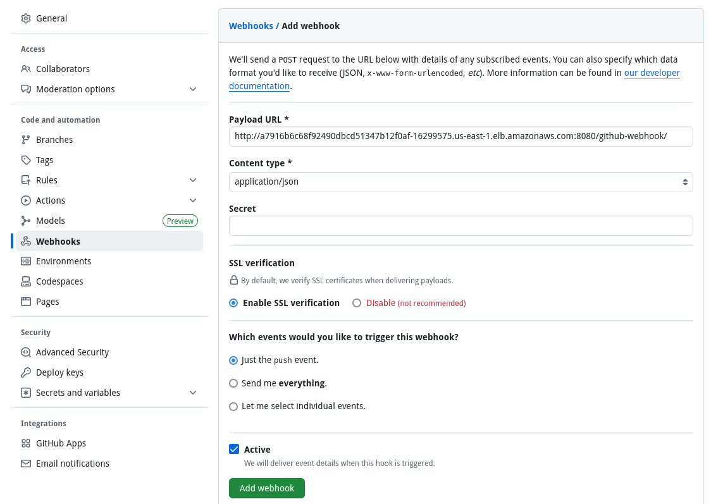

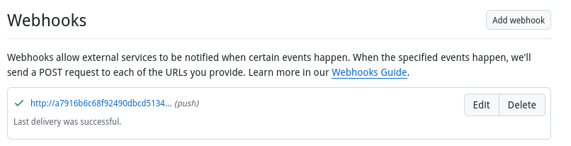

---
#### I. Create the cloud & pipeline using dashboard :

- Kubernetes Cloud Creation : 
  > - Manage Jenkins ➔ Clouds ➔ New Cloud ➔ **Cloud Name** : **kubernetes** & **Type** : **Kubernetes** ➔ Create  
  > - **Kubernetes Namespace** : jenkins  
  > - **Jenkins URL** : `http://jenkins.jenkins.svc.cluster.local:8080`  
  > - **Jenkins Tunnel** : `jenkins-agent.jenkins.svc.cluster.local:50000` 

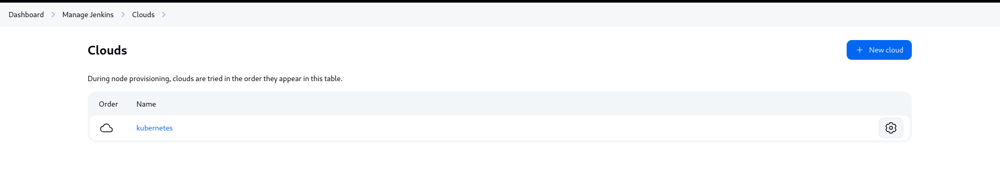

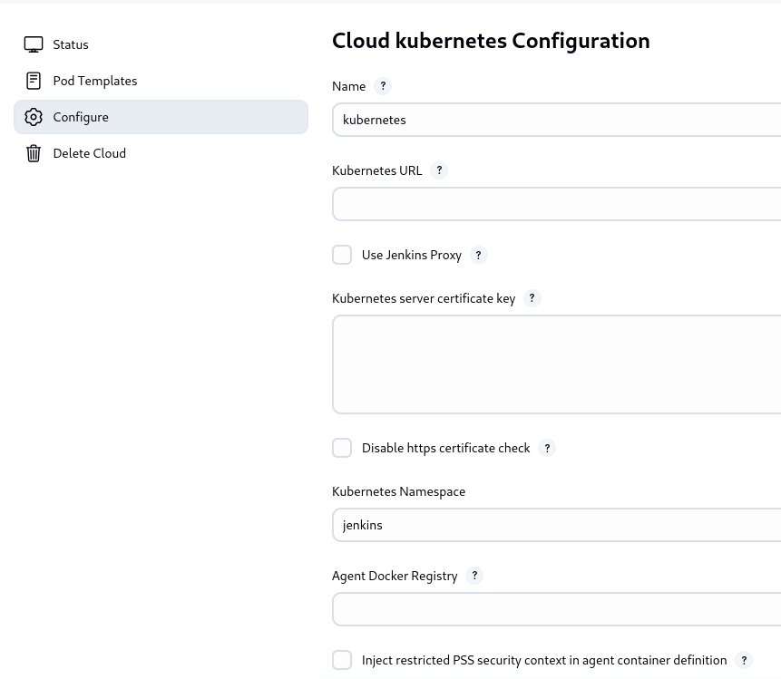

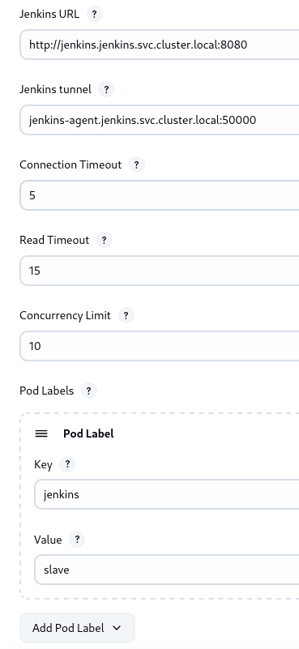

- Pipeline Creation : 
  > - Manage Jenkins ➔ New Item ➔ Enter pipleine name & choose **pipeline**  
  > - In Triggers Section : Check this option ( **GitHub hook trigger for GITScm polling** )  
  > - In Pipleine Section : Definition ➔ Choose **Pipeline script from SCM**
  > - In SCM Section inside previous section : Choose **git** ➔ **Repository URL** : `https://github.com/<Your-GitHub_USERNAME>/<YOUR_REPO_NAME>.git` ➔ **Branch Specifier** : ***/main** ➔ **Script Path** : **Jenkins/Jenkinsfile**

- Then the pipleine will automatically trigger - by the help of github webhook - any change on the repo and will build new image and push to ECR upon any change in **Nodeapp Dir.**

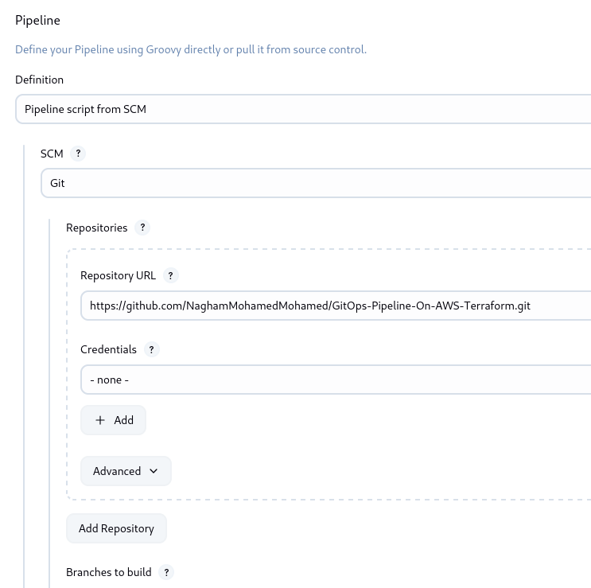

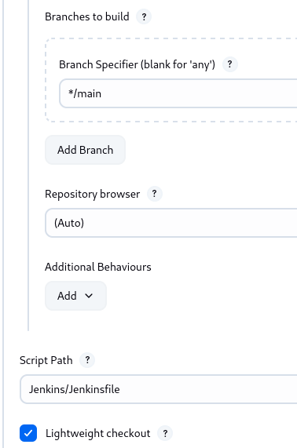

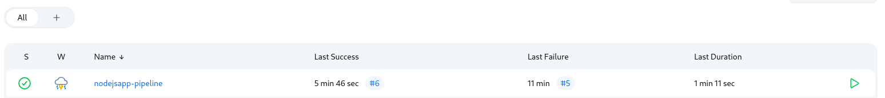

---

### 🔐 4. Secrets Management – External Secrets Operator  Secrets Management

#### 🧠 Concept :
Setting up External Secrets Operator (ESO) in Kubernetes to securely manage application secrets. We'll use Helm to deploy ESO, configure access using a service account, and create secrets for MySQL and Redis.

#### 📋 Setup Steps :

#### A. Create a Dedicated Namespace for the Application :

```sh
kubectl create namespace app
kubectl get ns
```

#### B. Apply the ESO Service Account :

```sh
kubectl apply -f eso-service-account.yaml
```

#### C. Add the External Secrets Helm Repository :

```sh
helm repo add external-secrets https://charts.external-secrets.io
helm repo update
```

#### D. Install External Secrets Operator via Helm :

```sh
helm upgrade --install external-secrets external-secrets/external-secrets \
  --namespace external-secrets \
  --set serviceAccount.create=false \
  --set serviceAccount.name=external-secrets-sa
```

#### E. Apply the SecretStore :
```sh
kubectl apply -f secretstore.yaml
```

#### F. Apply Secret Definitions (MySQL & Redis) :

```sh
kubectl apply -f mysql-secret.yaml
kubectl apply -f redis-secret.yaml
```
> [!Note]  
> They map a key in your external secret manager to a Kubernetes secret object (e.g., fetch from AWS Secrets Manager and create a Secret in Kubernetes).
---

### 🖥️ 5. Application: NodeJS App with MySQL and Redis

#### 🧠 Concept :
Deploy the Node.js application backend and its essential dependencies—MySQL (for persistent data storage) and Redis (for caching or session storage)— within the Kubernetes cluster.

It leverages Bitnami Helm Charts for rapid, production-grade deployments of MySQL and Redis inside the same namespace (app) used by the Node.js application

#### 📋 Setup Steps :

#### A. MySQL Deployment : 

```sh
# 1. Add the Bitnami Helm repository (if not already added)
helm repo add bitnami https://charts.bitnami.com/bitnami

# 2. Update your local Helm chart repository
helm repo update

# 3. Search to verify the latest MySQL chart
helm search repo bitnami/mysql

# 4. Skip creating a storage class again — as it was applied before in jenkins part ( same storage class used used here )
# kubectl apply -f storageclass.yml

# 5. Deploy MySQL using custom values
helm install mysql bitnami/mysql --namespace app -f mysql-values.yml

# 6. Watch MySQL pod(s) until they are running
kubectl get pods -n app -w
```

#### B. MySQL Access & Configuration :

```sh
# Once the MySQL pod is running, you can connect to it and create a custom user
kubectl run mysql-release-client --rm -it --restart='Never' \
  --image=docker.io/bitnami/mysql:9.3.0-debian-12-r2 \
  --namespace app \
  --env MYSQL_ROOT_PASSWORD=$MYSQL_ROOT_PASSWORD \
  --command -- bash

# Once inside the container, log in and run this command
mysql -h mysql.app.svc.cluster.local -uroot -p"$MYSQL_ROOT_PASSWORD"

# Create an application user
CREATE USER 'admin'@'%' IDENTIFIED BY 'strong-mysql-password';
FLUSH PRIVILEGES;
```

#### C. Redis Deployment :

```sh
# Deploy Redis in the same app namespace using a custom values file
helm install redis-release bitnami/redis --namespace app -f redis-values.yml
```

#### D. View Built Images in ECR :

```sh
# List Docker image tags that have been pushed to your AWS ECR repository (typically by Jenkins through Kaniko CI pipeline).
aws ecr list-images --repository-name gitops-gp-ecr \
  --query 'imageIds[*].imageTag' \
  --output text
```

---

### 📦 6. CD Tool – ArgoCD + Argo Image Updater

#### 🧠 Concept :

This section outlines how to set up ArgoCD, a declarative GitOps continuous delivery tool for Kubernetes, and integrate it with Argo Image Updater, a plugin that automatically updates Kubernetes workloads when a new container image is pushed to a registry (like AWS ECR).

While ArgoCD ensures your live Kubernetes state matches the Git repository by pulling application manifests from a Git repository and deploys them to a Kubernetes cluster, Argo Image Updater extends that by automatically detecting new container image versions (from registries like AWS ECR) and updating the Git repo manifests accordingly and write back to the repo ( through a commit ). This automates application redeployments whenever a new image is pushed — achieving fully automated CI/CD with GitOps.

#### 📋 ArgoCD Setup Steps :


#### A. Add ArgoCD Helm Repository :

```sh
helm repo add argo https://argoproj.github.io/argo-helm
helm repo update
```

#### B. Install ArgoCD into Your Cluster :

```sh
kubectl create namespace argocd
helm install argocd argo/argo-cd --namespace argocd
kubectl get pods -n argocd
```

#### C. Access ArgoCD Web UI :

```sh
kubectl port-forward service/argocd-server -n argocd 8080:443
```

- This forwards the ArgoCD server to your local machine. You can now access the dashboard via http://localhost:8080.

#### D. Get the ArgoCD Admin Password :

```sh
kubectl -n argocd get secret argocd-initial-admin-secret -o jsonpath="{.data.password}" | base64 -d
```

#### E. Install ArgoCD CLI :

```sh
curl -sSL -o argocd https://github.com/argoproj/argo-cd/releases/latest/download/argocd-linux-amd64
chmod +x argocd
sudo mv argocd /usr/local/bin/
```

#### F. Login to ArgoCD CLI :

```sh
argocd login localhost:8080 --username admin --password <retrieved-password> --insecure
```

#### G. Register EKS Cluster with ArgoCD :

```sh
kubectl config get-contexts
argocd cluster add arn:aws:eks:us-east-1:<YOUR_AWS_ACCOUNT_ID>:cluster/gitops-gp-eks-cluster
```

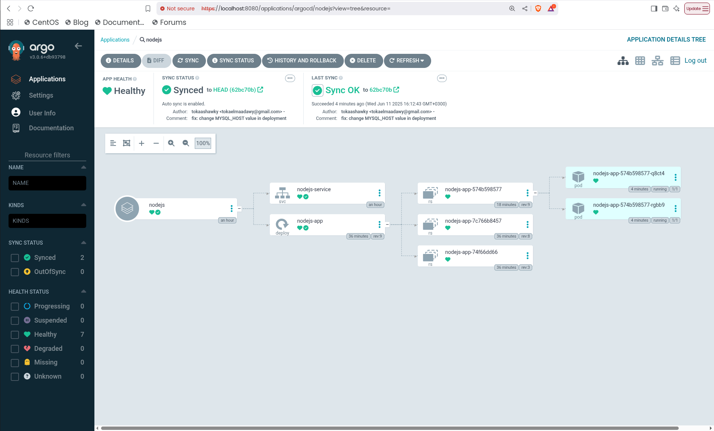
---

#### 📋 ArgoCD Image Updater Setup Steps :

#### A. Install Argo Image Updater via Helm :

```sh
helm install argocd-image-updater argo/argocd-image-updater \
  --namespace argocd \
  --version 0.12.2 \
  -f image-updater-values.yml
```

#### B. Add GitHub Credentials Secret :

```sh
kubectl create secret generic git-creds -n argocd \
  --from-literal=username=Your_GitHub_Username \
  --from-literal=password=Your_GitHub_PAT
```

> [!Note]  
> This creates a Kubernetes secret that allows Argo Image Updater to write back updated image tags to your Git repo. ( PAT ➔ Personal Access Token )

#### C. Annotate Your ArgoCD App with Image Update Rules Through ArgoCD Dashboard :

argocd-image-updater.argoproj.io/image-list: **nodeapp=576607007321.dkr.ecr.us-east-1.amazonaws.com/gitops-gp-ecr**  
argocd-image-updater.argoproj.io/write-back-method: **git:secret:argocd/git-creds**  
argocd-image-updater.argoproj.io/git-branch: **main**  
argocd-image-updater.argoproj.io/nodeapp.update-strategy: **semver**


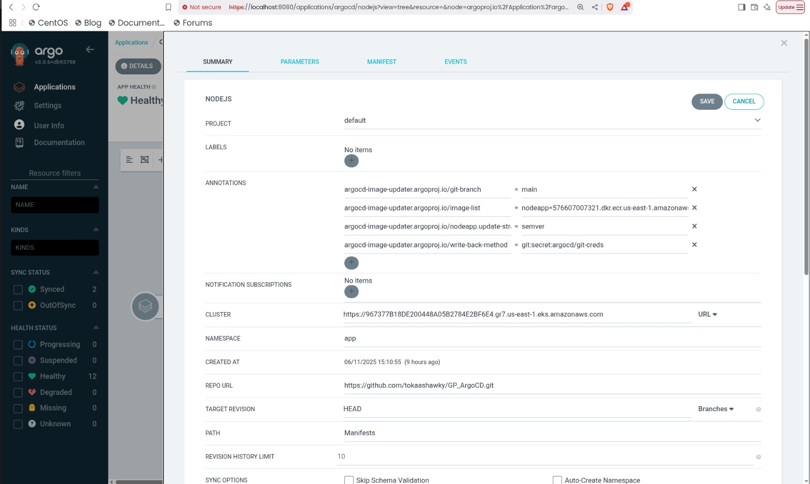

#### D. Validate Argo Image Updater is Running : 

```sh
kubectl get pods -n argocd
kubectl logs <argocd-image-updater-pod-name> -n argocd
```

## 🚀 CI/CD Flow

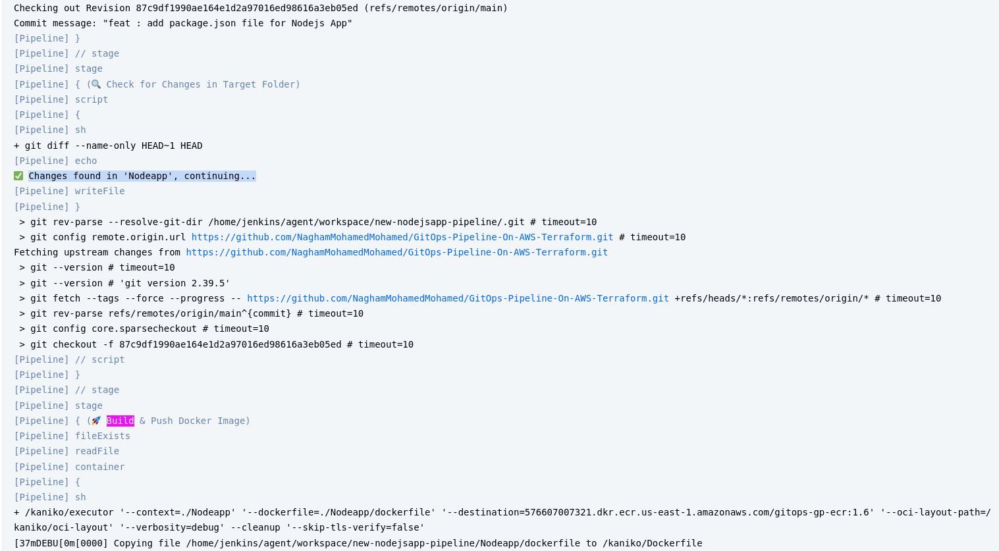

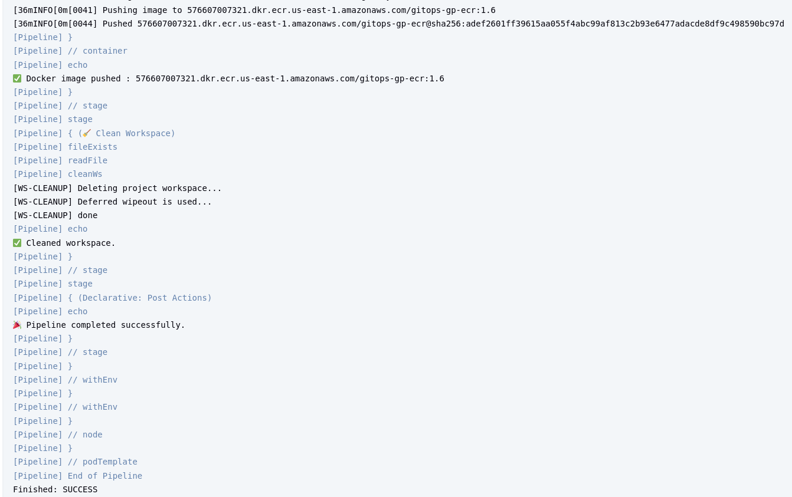

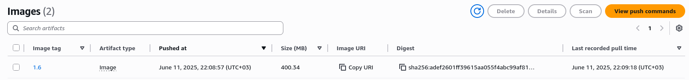

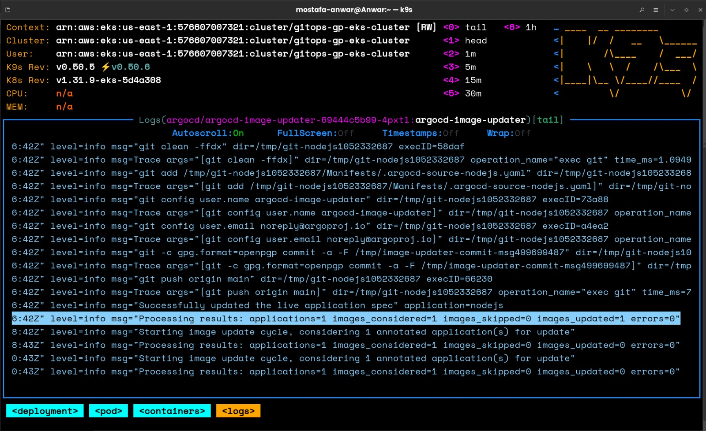

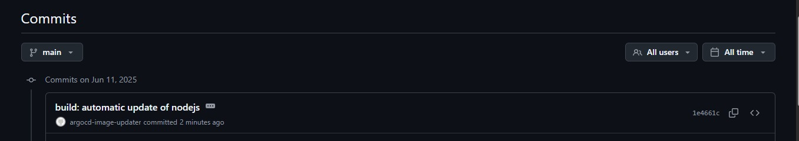

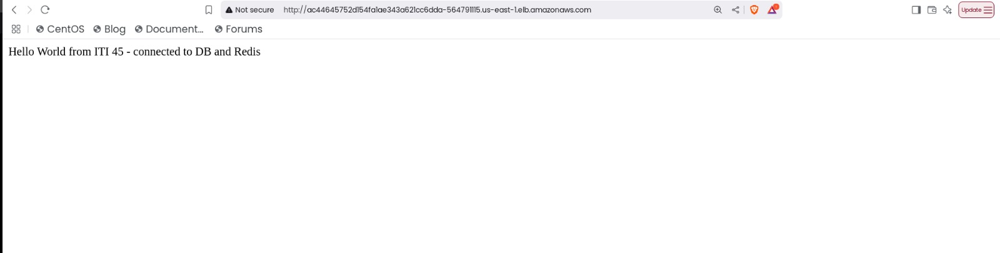

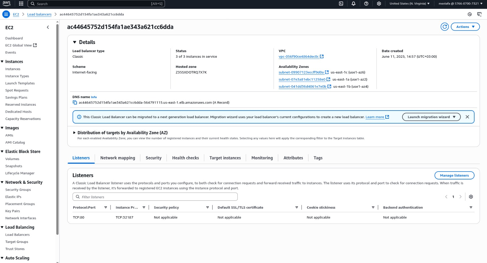

### Same Cycle is repeated upon any change in any of apps dir ( Final App Deployment )

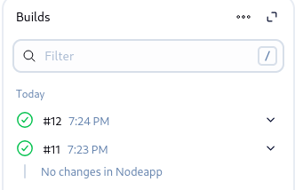

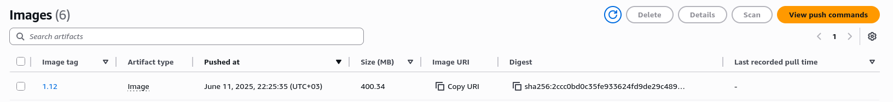

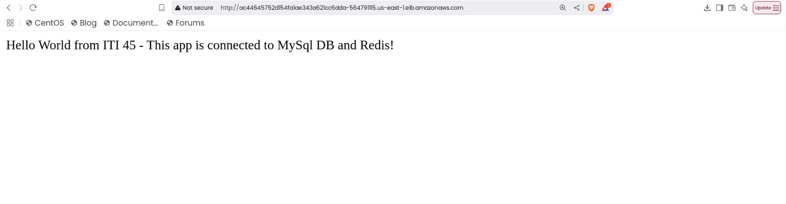


---

## 🔗 References
- [AWS Documentation](https://docs.aws.amazon.com/)
- [Terraform Documentation](https://developer.hashicorp.com/terraform/docs)  
- [Helm Documentation](https://helm.sh/docs/)
- [Helm Charts Documentation](https://artifacthub.io/)
- [Jenkins Documentation](https://www.jenkins.io/doc/)
- [Kaniko Build For for Container Building](https://www.youtube.com/watch?v=qSK3HNirASU)
- [ArgoCD Documentation](https://argo-cd.readthedocs.io/en/stable/)  
- [Argo Image Updater](https://medium.com/@topahadzi/argocd-image-updater-c169697b2072)
- [External Secrets Operator Documentation](https://external-secrets.io/latest/provider/aws-secrets-manager/)